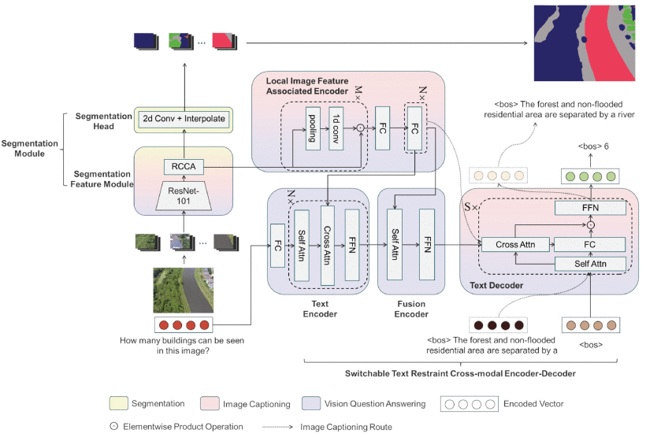

# FloodNet+
A repository for 'See, Perceive and Answer: A Unified Benchmark for High-resolution Post-disaster Evaluation in Remote Sensing Images' and its data set FloodNet+.
<div align=center>  

</div>

## News
2025/3/22
The code demo is available now.
## DataSet
FloodNet+ is available: [dataset](https://drive.google.com/drive/folders/16anyEZRtKG6CTXsUQOq5Nzc_RBPdibHb?usp=drive_link)

## Installation
### Requirement
* Python >= 3.9, CUDA >= 11.3
* PyTorch >= 1.12.0, torchvision >= 0.6.1
* Other packages: pycocotools, tensorboard, tqdm, h5py, nltk, einops, hydra, spacy, and timm

* Create an environment and install PyTorch and torchvision:
```shell
conda create -n floodnet_plus python=3.9
conda activate floodnet_plus
pip install torch torchvision --extra-index-url https://download.pytorch.org/whl/cu113
```
* Install other requirements:
```shell
pip install -r requirements.txt
python -m spacy download en
# ^ if you encounter missing packages during runtime, please install them accordingly.
```
* Import metric package:
1. install Java. The Linux version of the Java installer can be found [here](https://drive.google.com/drive/folders/1bENQbrLzw3s7BEPJW9ihWxUc-f_CwBAH?usp=drive_link). You may also download it directly from the official Java website.
2. Update the Java executable path in all JAR execution commands to your installation directory, such as here. 

* Download weights for resnet.

## Usage
run main.py for training.

## Citation
If you find this code useful, please kindly cite the paper with the following bibtex:
```bibtex
@article{zhao2024see,
  title={See, perceive and answer: A unified benchmark for high-resolution post-disaster evaluation in remote sensing images},
  author={Zhao, Danpei and Lu, Jiankai and Yuan, Bo},
  journal={IEEE Transactions on Geoscience and Remote Sensing},
  year={2024},
  publisher={IEEE}
}
```

## Acknowledgement
This project is built upon the following open-source code: [[GRIT]](https://github.com/davidnvq/grit)[[CCNet]](https://github.com/speedinghzl/CCNet)

We thank the authors of these open source projects.